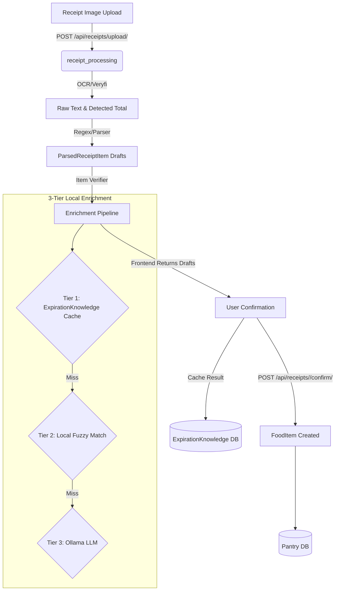
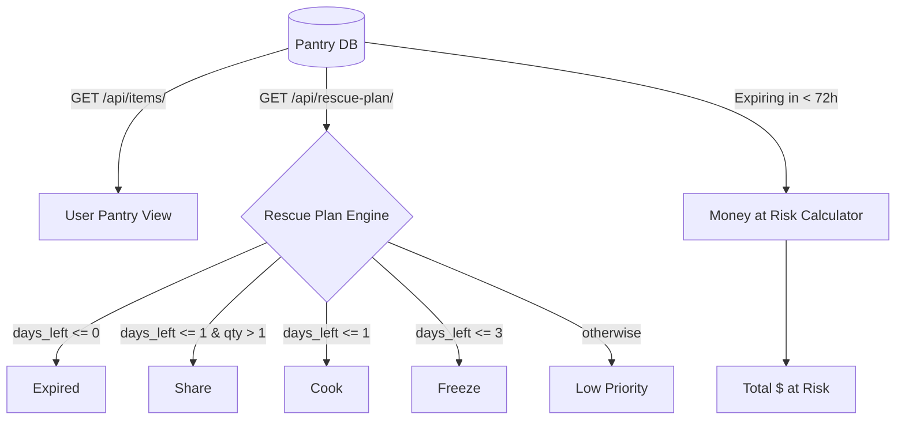
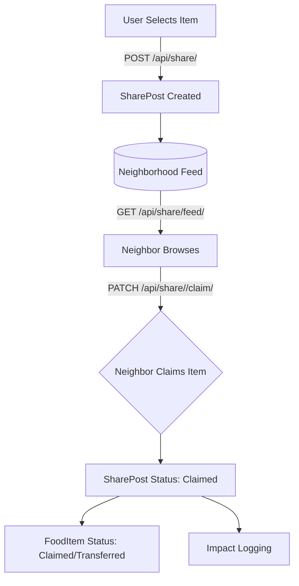
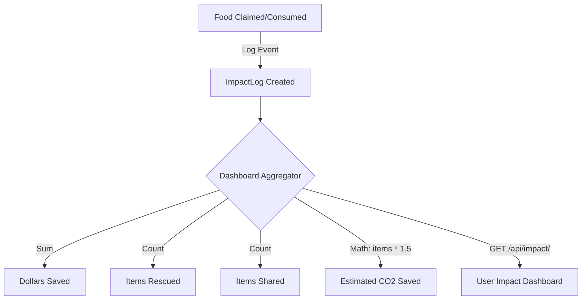

# NeighborFridge Data Pipelines

This document outlines the core data flows and pipelines in the NeighborFridge application. The primary workflows cover receipt ingestion, food management (pantry), food sharing, and environmental/financial impact tracking.

## 1. Receipt Ingestion & Item Enrichment Pipeline

This pipeline handles the process of converting a physical grocery receipt image into verified food inventory items.

### Key Models
- **`Receipt`**: Stores the raw uploaded image and the OCR extracted text.
- **`ParsedReceiptItem`**: A temporary or "draft" model holding the extracted information before user confirmation. Includes fields for AI-enriched data like `standardized_name`, `category_tag`, and `expiration_days`.
- **`ExpirationKnowledge`**: A cached lookup table mapping verified food products to their expected shelf life, category tags, and estimated prices. Updated automatically after every enrichment.

### Enrichment Details
The Item Verifier (`core/services/item_verifier.py`) uses a fully local pipeline:
1. **DB Cache**: Instant lookup of previously enriched items.
2. **Local Fuzzy Matching**: 150+ item grocery database with abbreviation expansion and multi-strategy matching (`core/services/grocery_db.py`).
3. **Ollama (gemma2)**: Local LLM for brand-specific or obscure items. No API key needed.

See [Expiration Methodology](./expiration_methodology.md) for full details.

---

## 2. Pantry Inventory & Rescue Plan Pipeline

Once food is confirmed and stored in the database, the app categorizes it by urgency to prevent waste.

### Key Logic
- **Rescue Plan**: Categorizes active `FoodItem` objects based on their computed `days_left` until expiration.
- **Money at Risk**: Calculates the sum of `estimated_price` for all `FoodItem` records that are expiring within the next 72 hours.

---

## 3. Neighborhood Sharing Pipeline

Users can opt to share items they won't consume before they expire.

### Key Models
- **`FoodItem`**: The original item. Its `status` updates when claimed.
- **`SharePost`**: The public listing attached to a `FoodItem`, containing `pickup_location` and `claimed_by` information.

---

## 4. Impact Tracking Pipeline

Every successful food rescue generates metrics to show users their environmental and financial impact.

### Key Models
- **`ImpactLog`**: Records specific events (`action`) tied to a `FoodItem` and the financial value (`dollars_saved`) associated with that action.
