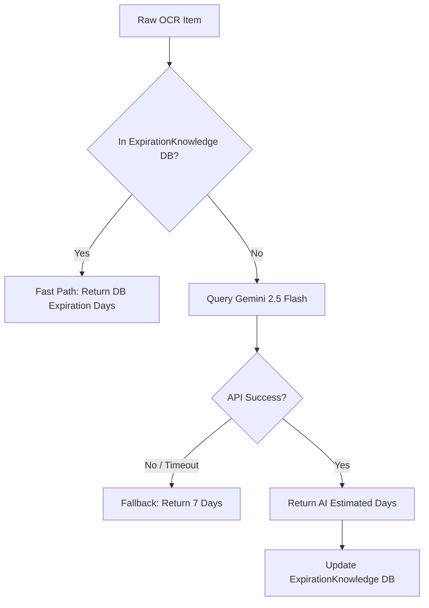

# Expiration Date Methodology

This document outlines the system's methodology for determining the estimated shelf life (expiration days) of food items processed from grocery receipts in the NeighborFridge app.

## The Core Formula

The absolute expiration date assigned to a pantry item is calculated as:

**`Expiration Date = Current Date + Estimated Expiration Days`**

The `Estimated Expiration Days` is an integer representing the expected shelf life of the product from the day of purchase. This integer is derived via the `item_verifier` AI service.

## AI Verification Workflow

The process of determining a product's expiration days follows a highly optimized 4-step pipeline, implemented in `Backend/core/services/item_verifier.py`.

### 1. Knowledge Base Lookup (Fast Path)
Before relying on external LLM APIs, the system attempts to resolve the item locally:
- It queries the `ExpirationKnowledge` database table for an exact (case-insensitive) match of the raw OCR item name.
- If a match is found, the historically verified `expiration_days` is retrieved instantly.
- **Benefit:** Saves API costs, prevents halluinations on known data, and reduces latency for common, repeatedly purchased items.

### 2. LLM Inference (Gemini AI Path)
If the item is not found in the local knowledge base, the raw OCR string and the store name are sent to the **Google Gemini 2.5 Flash** model.
- **Context:** The AI is specifically prompted to act as a grocery assistant.
- **Instruction:** It is required to output a JSON object containing an `expiration_days` integer, which represents the estimated shelf life in days from purchase.
- **Reasoning:** Gemini leverages its vast pre-trained understanding of food types to estimate reasonable shelf lives (e.g., assigning ~14 days to milk, 3-4 days to raw poultry, or 365+ days to canned goods).

### 3. Fallback Mechanism
To ensure app stability and prevent processing bottlenecks, a graceful fallback is implemented:
- If the Gemini API call fails, times out, or if the `GEMINI_API_KEY` is missing from the environment, the system catches the exception and assigns a safe default value.
- **Default Value:** `7 days` (1 week).

### 4. Continuous Learning
Once the Gemini model successfully infers the details for a new item, the system automatically trains itself:
- A new record is created in the `ExpirationKnowledge` table, mapping the standardized food name to its newly inferred `expiration_days`.
- **Benefit:** This ensures that subsequent uploads of the exact same raw receipt item will hit the "Fast Path" (Step 1) instead of requiring another LLM call, making the system faster and more reliable over time.
