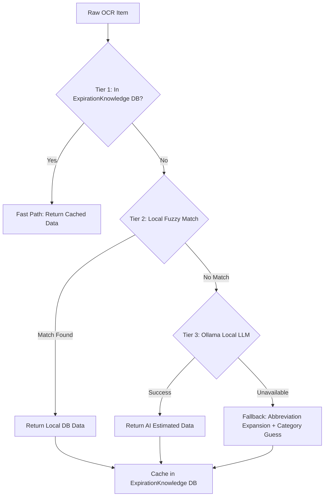

# Expiration Date Methodology

This document outlines the system's methodology for determining the estimated shelf life (expiration days) of food items processed from grocery receipts in the NeighborFridge app.

## The Core Formula

The absolute expiration date assigned to a pantry item is calculated as:

**`Expiration Date = Current Date + Estimated Expiration Days`**

The `Estimated Expiration Days` is an integer representing the expected shelf life of the product from the day of purchase. This integer is derived via the `item_verifier` enrichment service.

## Enrichment Pipeline Architecture

The process of determining a product's name, category, and expiration days follows a **3-tier pipeline** that runs entirely locally — no cloud API keys required. Implemented in `Backend/core/services/item_verifier.py`.



### Tier 1: ExpirationKnowledge DB Cache (Instant)
Before any processing, the system checks for a prior result:
- Queries the `ExpirationKnowledge` table for an exact (case-insensitive) match of the raw OCR item name.
- If found, returns historically verified `expiration_days`, `category_tag`, and `standardized_name` instantly.
- **Benefit:** Zero processing time for repeat items. The system learns from every receipt.

### Tier 2: Local Grocery DB + Fuzzy Matching (Fast, Offline)
If no cache hit, the raw OCR string is matched against a built-in grocery knowledge base of **150+ common items** (`Backend/core/services/grocery_db.py`).

The matching algorithm uses multiple strategies:
1. **Abbreviation Expansion**: Converts receipt shorthand (e.g., `HNYCRSP APPL 3LB` → `HONEYCRISP APPLE`) using a curated map of 80+ receipt abbreviations.
2. **Exact Match**: Checks the expanded name against the database.
3. **Token Overlap Scoring**: Matches individual words between the input and database entries, ignoring noise words like weights and quantities.
4. **Fuzzy Ratio Matching**: Uses `difflib.SequenceMatcher` to find the closest match when exact/token matching fails.

A confidence threshold of **0.55** is required to accept a match. Each database entry provides:
- Standardized product name (e.g., "Honeycrisp Apples")
- Category tag (produce, dairy, meat, bakery, pantry, frozen, beverage, condiment, deli)
- Shelf life in days (researched values, e.g., bananas = 5 days, chicken = 3 days)
- Human-readable description

### Tier 3: Ollama Local LLM Fallback (Smart, Offline)
For items the local DB cannot confidently match (brand-specific, niche, or unusual items), the system sends a batch request to a locally running **Ollama** instance:
- **Model**: `gemma2` (9B parameters, runs on-device)
- **Prompt**: Structured JSON request asking for standardized name, category, expiration days, and description.
- **Timeout**: 30 seconds per batch.
- **Examples**: Successfully identifies items like `SIGGI SKYR VAN` → "Siggi's Icelandic Skyr Vanilla" (dairy, 14 days), or `RXBAR CHOC SEA` → "RXBAR Chocolate Sea Salt" (pantry, 30 days).

### Final Fallback
If Ollama is not running or fails, the system still produces a reasonable result:
- Expands abbreviations to build a readable name.
- Guesses the category using keyword analysis.
- Assigns category-based default shelf life (e.g., produce = 7 days, dairy = 10 days, meat = 3 days).

<<<<<<< Updated upstream
### 4. Continuous Learning
Once the Gemini model successfully infers the details for a new item, the system automatically trains itself:
- A new record is created in the `ExpirationKnowledge` table, mapping the standardized food name to its newly inferred `expiration_days`.
- **Benefit:** This ensures that subsequent uploads of the exact same raw receipt item will hit the "Fast Path" (Step 1) instead of requiring another LLM call, making the system faster and more reliable over time.
=======
A confidence threshold of **0.55** is required to accept a match. Each database entry provides:
- Standardized product name (e.g., "Honeycrisp Apples")
- Category tag (produce, dairy, meat, bakery, pantry, frozen, beverage, condiment, deli)
- Shelf life in days (researched values, e.g., bananas = 5 days, chicken = 3 days)
- Human-readable description

### Tier 3: Ollama Local LLM Fallback (Smart, Offline)
For items the local DB cannot confidently match (brand-specific, niche, or unusual items), the system sends a batch request to a locally running **Ollama** instance:
- **Model**: `gemma2` (9B parameters, runs on-device)
- **Prompt**: Structured JSON request asking for standardized name, category, expiration days, and description.
- **Timeout**: 30 seconds per batch.
- **Examples**: Successfully identifies items like `SIGGI SKYR VAN` → "Siggi's Icelandic Skyr Vanilla" (dairy, 14 days), or `RXBAR CHOC SEA` → "RXBAR Chocolate Sea Salt" (pantry, 30 days).

### Final Fallback
If Ollama is not running or fails, the system still produces a reasonable result:
- Expands abbreviations to build a readable name.
- Guesses the category using keyword analysis.
- Assigns category-based default shelf life (e.g., produce = 7 days, dairy = 10 days, meat = 3 days).

### Continuous Learning
Every successful enrichment result (from any tier) is saved back to the `ExpirationKnowledge` table, ensuring:
- The same item on a future receipt hits Tier 1 (instant) instead of requiring reprocessing.
- The system gets faster and more reliable with each receipt scanned.

## Running the Enrichment Pipeline

### Prerequisites
1. **Ollama** installed and running (for Tier 3):
   ```bash
   # Install Ollama (macOS)
   brew install ollama

   # Pull the gemma2 model
   ollama pull gemma2

   # Start the Ollama server (runs in background)
   ollama serve
   ```

2. **Python venv** activated with dependencies installed.

### Test the Pipeline
```bash
cd Backend
source .venv/bin/activate

# Test enrichment only (hardcoded sample items)
python scratch/test_gemini.py

# Full E2E test: receipt image → OCR → enrichment
python scratch/test_e2e.py /path/to/receipt.jpg
python scratch/test_e2e.py /path/to/receipt.jpg --provider local   # force local OCR
python scratch/test_e2e.py /path/to/receipt.jpg --provider veryfi  # force Veryfi OCR
```

### Environment Variables (Optional)
| Variable | Default | Description |
|---|---|---|
| `OLLAMA_URL` | `http://localhost:11434` | Ollama server URL |
| `OLLAMA_MODEL` | `gemma2` | Ollama model to use |

> **Note:** No API keys are required. The entire pipeline runs locally.
>>>>>>> Stashed changes
